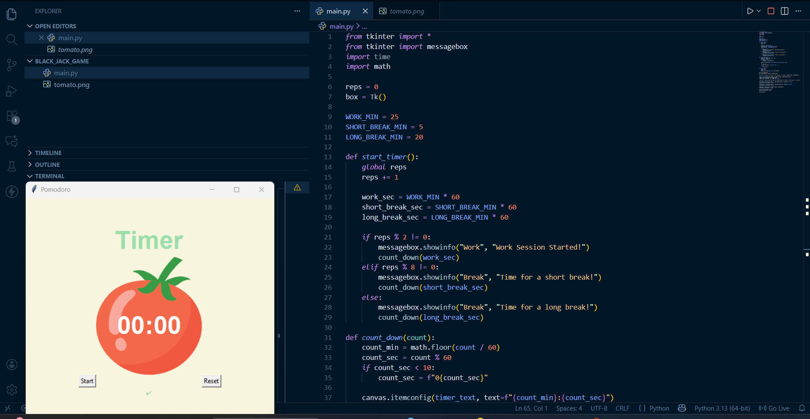
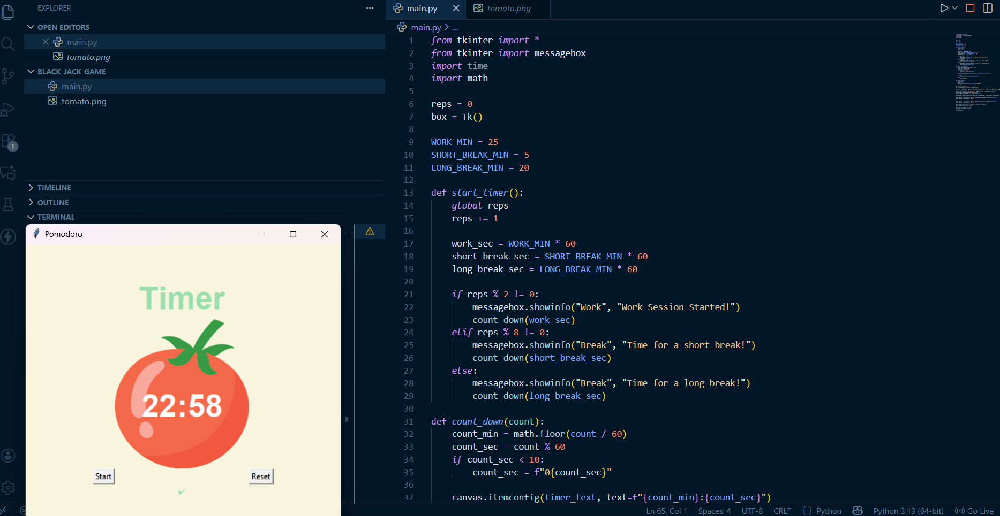

Pomodoro Timer – Tkinter App

Project Layout:
   

OutPut Result:
  

This project is a simple Pomodoro Timer made using Python Tkinter. It helps you stay focused by dividing time into work sessions and break breaks.

Features:
25-minute work time
5-minute short break
20-minute long break
Automatic cycle switching
Very simple interface with images

How It Works:
Press Start to begin.
A work timer runs first.
A pop-up appears when break time starts.
After four cycles, a long break starts automatically.

Buttons:
Start begins the timer.
Reset sets the timer back to 00:00.

How to Run:
Keep the python file, tomato.png, and result.png in the same folder.
Run the program using Python.

Short Description:
A simple and clean Pomodoro timer app that helps improve focus and productivity using timed work and break periods.
